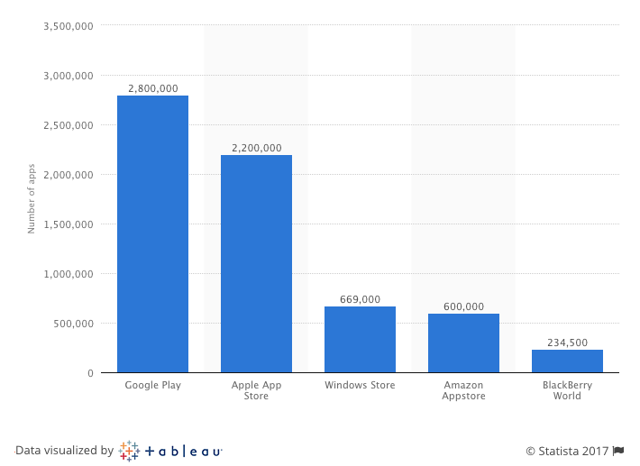
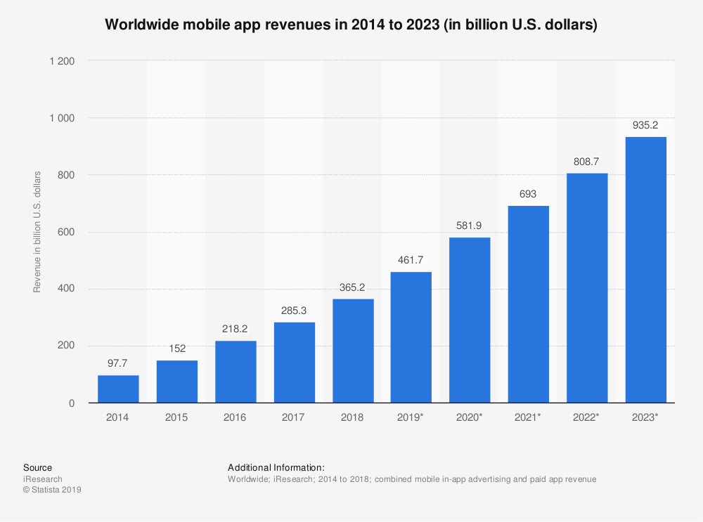
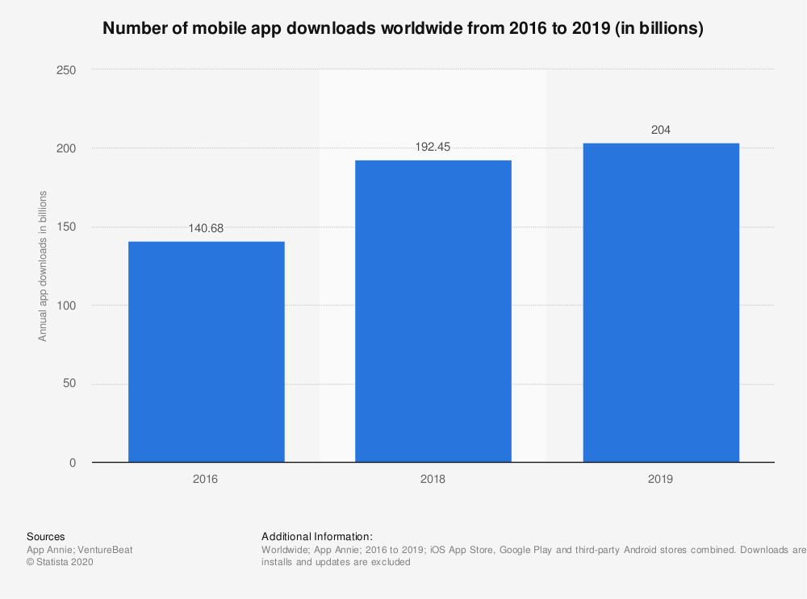
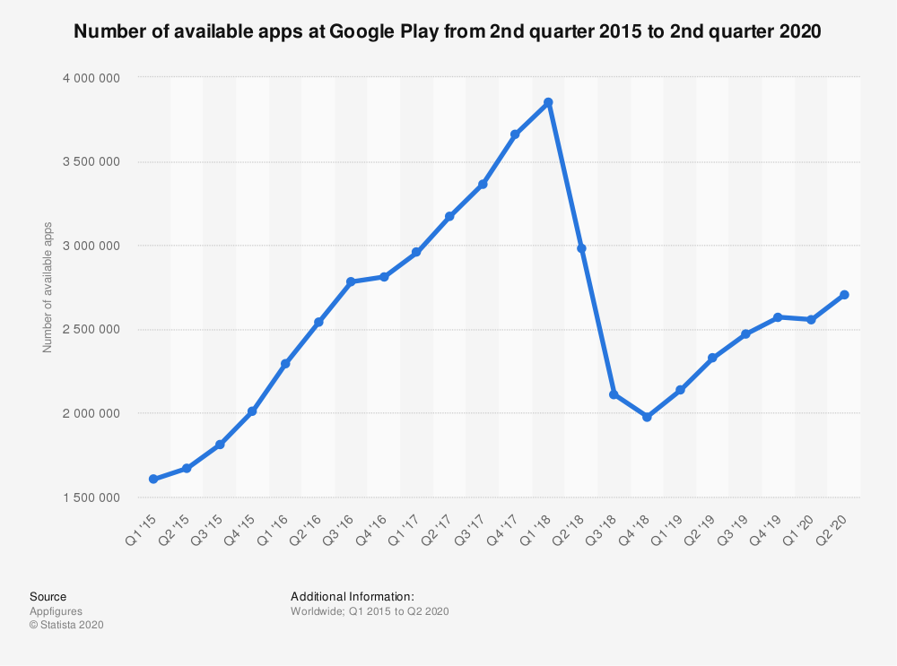

<title>Aula 1 — Slides</title>

# **SISB020 - Desenvolvimento de Software para Dispositivos Móveis**

## Aula 1

Prof. Thiago Cavalcante

---

<!-- paginate: true -->

# Cronograma

| Semana | Data       | Evento        |
| :----- | :--------- | :------------ |
| 01     | 21/10/2020 | Aulas e Lista |
| 02     | 28/10/2020 | Aulas e Lista |
| 03     | 04/11/2020 | Aulas e Lista |
| 04     | 11/11/2020 | Encontro      |
| 05     | 18/11/2020 | AB1           |
| 06     | 25/11/2020 | Aulas e Lista |
| 07     | 02/11/2020 | Aulas e Lista |
| 08     | 09/12/2020 | Aulas e Lista |
| 09     | 16/12/2020 | Encontro      |
| 10     | 23/12/2020 | AB2           |
| 11     | 06/01/2021 | Reavaliação   |
| 12     | 13/01/2021 | Final         |

---

<!-- _class: large-ul -->

# Avaliação

- Listas: 30%
- Provas: 60%
- Participação: 10% (entregas)

---

<!-- _class: large-ul -->

# Google Classroom

- Aulas
- Atividades
- Materiais
- Dúvidas

---

# Conceitos de Desenvolvimento de Apps para Celular

## + Prática com **Flutter**

---

# Vídeo: Como fazer um app?

  <iframe
    width="560"
    height="315"
    src="https://www.youtube.com/embed/tClRHOnHveY"
    frameborder="0"
    allow="accelerometer;
          autoplay;
          clipboard-write;
          encrypted-media;
          gyroscope;
          picture-in-picture"
    allowfullscreen>
  </iframe>

---

<!-- _class: small-ul -->

## Artigos sobre o Processo de Desenvolvimento de um App

* [**BuildFire** — 8 Steps to Understanding The MAD Lifecycle (2016)](https://buildfire.com/understanding-mobile-app-development-lifecycle/)
* [**Invonto** — MAD Process: A Step-by-Step Guide (2020)](https://www.invonto.com/insights/mobile-app-development-process/)
* [**Systango** — MAD Process – How To Make an App (2020)](https://www.systango.com/blog/mobile-app-development-process/)
* [**Pixelfield** — The ultimate guide to MAD (2020)](https://pixelfield.co.uk/app-development/)

 

**Obs.**: MAD = Mobile App Development

---

# <!-- fit --> O que é um aplicativo móvel?

* Programa projetado para rodar em um dispositivo móvel (*smartphone*, *tablet*)
* Principais sistemas operacionais: **iOS** e **Android**
* Outros: iPadOS, Windows, Linux etc.
* Várias categorias: jogos, mídia, lojas, mensagens...
* Principais lojas de apps: **App Store** e **Google Play**

---

<!-- _footer: Fonte: [Statista](https://www.statista.com/statistics/276623) -->
<!-- _class: stats -->

# <!-- fit --> Número de aplicativos disponíveis nas principais lojas

---

# <!-- fit --> Por que desenvolver um app?

* Apps provocaram fortes mudanças em consumidores e empresas
* Traz **conveniência** aos consumidores
* Pode trazer **inovação** para um determinado mercado
* Alto potencial **disruptivo**: Uber, Netflix, Spotify

---

<!-- _footer: Fonte: [Statista](https://www.statista.com/statistics/269025) -->
<!-- _class: stats flex-align-top -->

# <!-- fit --> Estatísticas do Mercado de Apps

---

<!-- _footer: Fonte: [Statista](https://www.statista.com/statistics/271644) -->
<!-- _class: stats flex-align-top -->

# <!-- fit --> Estatísticas do Mercado de Apps

---

<!-- _footer: Fonte: [Statista](https://www.statista.com/statistics/289418) -->
<!-- _class: stats flex-align-top -->

# <!-- fit --> Estatísticas do Mercado de Apps

---

<!-- _footer: Fonte: [BuildFire](https://buildfire.com/understanding-mobile-app-development-lifecycle/) -->
<!-- _class: small-ul flex-align-top -->

# <!-- fit --> Estatísticas do Mercado de Apps

* Apps são responsáveis por **mais da metade do tempo de consumo de mídia digital**
* Usuários de *smartphones* gastam aprox. **90% do tempo de uso do dispositivo em apps**
* 85% dos usuários **prefere um app nativo** em vez de uma página web móvel
* Um usuário médio possui aprox. **30 apps instalados** no seu aparelho e passa aprox. **35h/mês usando-os**

---

# O **Processo de Desenvolvimento** de um App

---

# Ideias

* Converse com **todo mundo** sobre sua ideia
* Obtenha conselhos do máximo de pessoas que puder
* A ideia é uma parte **pequena** do sucesso do app :warning:
* Se é uma ideia **realmente** muito boa, você provavelmente não é o único que teve

---

# Inspirações para Ideias

* *"scratch your own itch"* (resolva seus problemas)
* Ideias "óbvias": por que ninguém nunca fez ______ ?
* Vácuo de mercado

---

# Estratégia, Pesquisa de Mercado e Planejamento

---

<!-- _class: small-ul blue-bold -->

* Que objetivo você pretende alcançar com seu app?
* Onde o seu app se encaixa nos seus planos de marketing?*
* Quem é seu público-alvo?
* O que seus consumidores em potencial desejam?
* Que segmento do público você vai usar para testar sua ideia?
* Como você quer que os seus consumidores usem seu app?
* Qual problema dos seus consumidores seu app vai resolver?
* Quais funções seu app terá?
* Qual plataforma pretende usar?
* **Que linguagem de programação ou framework de desenvolvimento de apps são mais apropriados?** :dart:

---

<!-- _class: small-ul -->

* Quais são os aplicativos similares que já existem?
* Quem são seus concorrentes? Eles fornecem apps?
* Quanto seus concorrentes cobram?
* Qual o plano de negócio deles e como você pode otimizar o seu plano de negócio?
* O que você vai fazer de diferente dos seus concorrentes?
* Qual o seu orçamento para o desenvolvimento do app?
* Qual o seu cronograma de desenvolvimento?
* Quando vai lançar o app?
* Como você vai divulgar e vender seu app?
* Como pretende gerar receita com seu app?
* Qual o principal apelo do seu app? (*"unique selling point"*)

---

# <!-- fit --> Restrições de tempo, recursos ou custo

 

**Produto Viável Mínimo**
(MVP — *Minimum Viable Product*)

---

<!-- _class: flex-space-evenly -->

# Design

**Experiência do Usuário**
(UX — *User Experience*)

**Interface do Usuário**
(UI — *User Interface*)

---

<!-- _class: flex-space-evenly -->

# Design

* Você precisa apelar para as emoções dos usuários
* Desenvolver um app pode levar meses, desinstalar leva segundos ¯\\\_(ツ)_/¯
* ~25% dos apps só são abertos **uma única vez!**

---

<!-- _footer: Fonte: [Statista](https://www.statista.com/statistics/271628) -->
<!-- _class: stats -->

---

<!-- _class: flex-space-evenly -->

# Design

> O propósito do design é entregar uma **experiência de usuário fluida** (interativa, intuitiva, amigavél) com uma **aparência impecável**
>
> Embora uma boa aparência ajude com a rápida adoção do app, ele deve possuir experiências de usuário intuitivas para manter os usuários engajados
