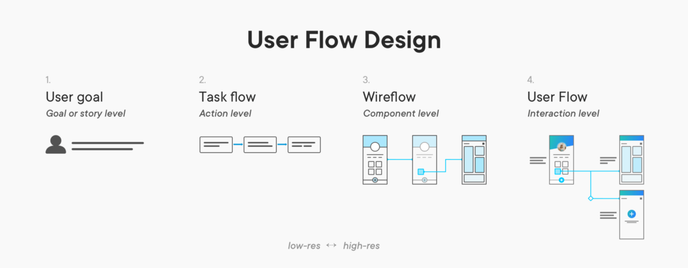
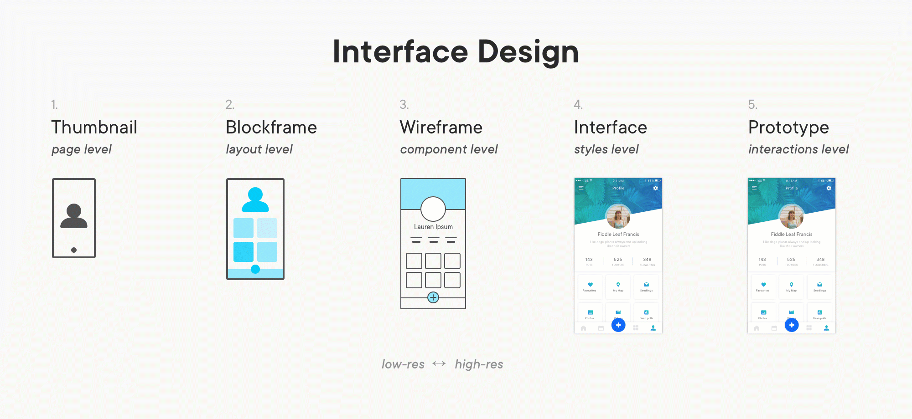

<title>Aula 2 — Slides</title>

# **SISB020 - Desenvolvimento de Software para Dispositivos Móveis**

## Aula 2

Prof. Thiago Cavalcante

---

<!-- paginate: true -->
<!-- _class: flex-space-evenly -->

# Design

**Experiência do Usuário**
(UX — *User Experience*)

**Interface do Usuário**
(UI — *User Interface*)

---

<!-- _class: flex-space-evenly -->

# Design

* Você precisa apelar para as emoções dos usuários
* Desenvolver um app pode levar meses, desinstalar leva segundos ¯\\\_(ツ)_/¯
* ~25% dos apps só são abertos **uma única vez!**

---

<!-- _footer: Fonte: [Statista](https://www.statista.com/statistics/271628) -->
<!-- _class: stats -->

---

<!-- _class: flex-space-evenly -->

# Design

> O propósito do design é entregar uma **experiência de usuário fluida** (interativa, intuitiva, amigavél) com uma **aparência impecável**
>
> Embora uma boa aparência ajude com a rápida adoção do app, ele deve possuir experiências de usuário intuitivas para manter os usuários engajados

---

<!-- _class: small-ul -->

# O que é um bom design?

* Apple: [iOS Human Interface Guidelines](https://developer.apple.com/design/human-interface-guidelines/)
* Google: [Material Design Principles](https://material.io/design/introduction)
* Agregadores de padrões de design
  - [Pttrns](https://pttrns.com/)
  - [Mobile Patterns](https://www.mobile-patterns.com/)
  - [Dribbble](https://dribbble.com/)
* Paletas de cores
  - [Color Hunt](https://colorhunt.co/)
  - [Flat UI Colors](https://flatuicolors.com/)
  - [Material Palette](https://www.materialpalette.com)

---

<!-- _footer: Fontes: [SmartDraw](https://www.smartdraw.com/flowchart/flowchart-symbols.htm) / [Dribbble](https://dribbble.com/shots/3511356/attachments/777237?mode=media) -->

# <!-- fit --> Diagrama de Fluxo de Usuário

---

# Wireframes

* Layouts conceituais do seu app (*rascunhos digitais*)
* Representações de **baixa fidelidade** que fornecem uma estrutura visual ao app
* Foco na **estética** e na **experiência do usuário**, ignorando cores e estilos
* [Diversas ferramentas online](https://www.creativebloq.com/wireframes/top-wireframing-tools-11121302)

---

<!-- _footer: Fonte: [Product Plan](https://www.productplan.com/glossary/wireframe/) -->

---

# Mockups

* Representações de **alta fidelidade** do seu app
* Aplicação do estilo e cores definidos aos *wireframes*
* *Screenshots* vindas "do futuro"
* Facilitam a comunicação com os programadores
* Nem sempre é necessário fazer (ambiente de desenvolvimento)
* [Comparação: *wireframes* $\times$ *mockups*](https://www.invonto.com/wp-content/uploads/2018/01/mobile-app-development-process-design.jpg)

---

# Protótipo

* Adicionar **interação** aos *mockups* ou *wireframes*
* Estático → Dinâmico
* Serve para simular a experiência do usuário e checar o diagrama de fluxo proposto para o app
* Pode ser testado por usuários comuns e **corrigido** :warning:
* [Diversas ferramentas online](https://www.shopify.com/partners/blog/62745923-5-of-the-best-prototyping-tools-to-test-out-your-web-and-mobile-designs)

---

<!-- _footer: Fonte: [UX Collective](https://uxdesign.cc/when-to-use-user-flows-guide-8b26ca9aa36a) -->

---

<!-- _footer: Fonte: [Systango](https://www.systango.com/blog/mobile-app-development-process/) -->

---

<!-- _footer: Fonte: [UX Collective](https://uxdesign.cc/when-to-use-user-flows-guide-8b26ca9aa36a) -->

---

# Recursos de Design

* Imagens retiradas de ferramentas de busca (p. ex., Google Imagens) podem ter **copyright**
* O ideal é usar recursos com licença *Creative Commons* ou **livres para uso comercial**
* Ícones: [Icon Store](https://iconstore.co/)
* Imagens: [Wunderstock](https://wunderstock.com/), [Unsplash](https://unsplash.com/)

---

> ### Algo que pode levar alguns **segundos** para ser alterado na fase de design vai acabar levando **dias** para ser feito, caso você precise mudar durante a fase de desenvolvimento.

---

# *Landing Page*

* Criar o app não é suficiente, as pessoas precisam **encontrá-lo**
* Parte da **estratégia de marketing**
* Não precisa ser uma página complexa, pode ser uma página estática **simples**
* Pode (deve?) ser criada antes da fase de design
* Permite uma conexão prévia com potenciais usuários
* Pode garantir muitos downloads no lançamento

---

# <!-- fit --> Elementos **essenciais** da *Landing Page*

* Título claro e objetivo no topo da página
* Pequena introdução sobre o app (pode ser um vídeo)
* *Screenshots* do app em funcionamento
* Botões (*call to action*)
  - Antes do lançamento: cadastro de e-mail (lista)
  - Após lançamento: instalação do app
* Características e benefícios do app
* Exemplos: [Zoom](https://www.zoom.us), [Evernote](https://www.evernote.com)
