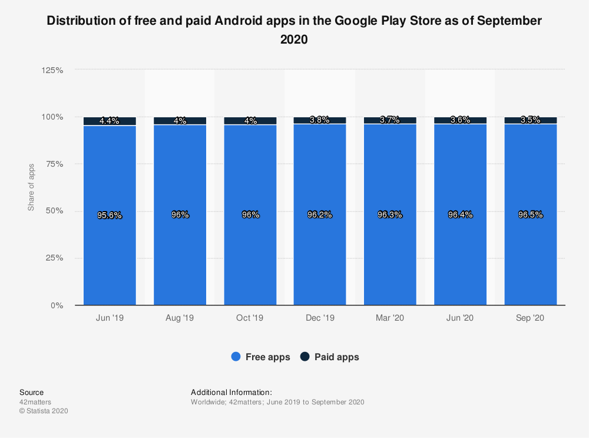

<title>Aula 3 — Slides</title>

# **SISB020 - Desenvolvimento de Software para Dispositivos Móveis**

## Aula 3

Prof. Thiago Cavalcante

---

<!-- paginate: true -->

# Monetização :moneybag:

* Algo que você deve ter em mente **antes** de começar o desenvolvimento
* Seu app não precisa ser pago para gerar receita
* Existem diversas estratégias de monetização

---

<!-- _footer: Fonte: [Statista](https://www.statista.com/statistics/266211) -->
<!-- _class: stats -->

---

<!-- _class: small-ul -->

# Estratégias de Monetização

### Propagandas dentro do app (*ads*)

* Tipos de oferta
  - CPC — Custo por Clique
  - CPA — Custo por Aquisição
  - CPM — Custo por Mil
* Não é necessário vender o app para empresas individuais (*ad networks*, *ad mediation platforms*)
* Pode ser usada em conjunto com uma **versão paga sem propagandas**

---

<!-- _class: small-ul -->

# Estratégias de Monetização

### Freemium

* Usuário pode instalar o app gratuitamente e tem acesso a uma parte das funcionalidades (limitado)
* Para acessar todas as funcionalidades, o usuário precisa pagar
* Pode ser um pagamento **único** ou **recorrente** (assinatura)
* Idealmente, a versão limitada deve **motivar** o usuário a adquirir a versão completa
* Comum em apps usados regularmente, que oferecem serviços de grande valor para o usuário (p. ex. Dropbox, Spotify)

---

<!-- _class: small-ul -->

# Estratégias de Monetização

### Compras dentro do app

* Representam aproximadamente **metade** da receita de todo o mercado de apps
* Podem ser produtos **reais** ou **virtuais**
* Produtos virtuais estão sujeitos à taxa da plataforma (30%)
* Produtos reais podem ser isentos da taxa

---

<!-- _class: small-ul -->

# Estratégias de Monetização

### App que acompanha produto ou serviço

* O app em si não gera receita
* Funciona como uma ferramenta de marketing para o seu serviço ou produto

---

<!-- _class: small-ul -->

# Estratégias de Monetização

### "Rótulo em branco" (*white labeling*)

* App com foco em uma determinada classe de serviços
* Template que pode ser customizado para cada cliente
* Desenvolvido uma vez, vendido várias vezes

---

<!-- _class: small-ul -->

# Estratégias de Monetização

### Parceria ou Patrocínio

* Incorporar uma grande empresa no seu app como parceira
* A área de atuação da empresa está fortemente ligada à missão do seu app
* A empresa patrocina seu app e você faz propaganda para o público-alvo da empresa

---

<!-- _class: small-ul -->

# Estratégias de Monetização

### Financiamento coletivo (*crowdfunding*)

* Plataformas onde os próprios usuários podem pagar, de maneira individual, para financiar um projeto
* Em geral, os projetos fornecem recompensas aos usuários
* Uma forma de evitar a utilização de propagandas no app

---

<!-- _class: small-ul -->

# Estratégias de Monetização

### Licenciamento de dados

* Apps baseados em comunidades de usuários podem fornecer dados para parceiros comerciais
* Precisa ser feito com responsabilidade, priorizando a privacidade do usuário

---

### Antes de falar sobre desenvolvimento... algumas perguntas

* Como proteger sua ideia?
* Quais os principais erros que podem ser cometidos durante o processo de criação de um app?
* O que esperar durante o processo de desenvolvimento?

---

<!-- _footer: Fonte: [Clutch](https://clutch.co/app-developers/resources/how-protect-your-app-idea) -->

# Como proteger sua ideia?

* Direitos autorais
  - código-fonte
  - marca (nome e logotipo)
  - layout
* Acordo de não-divulgação (NDA — *Non-disclosure Agreement*)
* Documentação

---

<!-- _footer: Fontes: [Clutch](https://clutch.co/app-developers/resources/reasons-apps-fail), [Clutch](https://clutch.co/app-developers/resources/development-mistakes-make-or-break-mobile-app-success), [Pixelfield](https://pixelfield.co.uk/app-development/#C3) -->

# Quais os principais erros?

* Falta de **originalidade**
* Falta de planejamento e estratégia
* App não foi testado o suficiente (validação)
* Escolher a plataforma errada
* Não entender as diferenças entre os SOs
* Estratégia de marketing incorreta ou insuficiente
* Focar apenas no app
* Achar que o trabalho termina no dia do lançamento

---

<!-- _footer: Fonte: [Clutch](https://clutch.co/app-developers/resources/what-to-expect-when-developing-app) -->

# O que esperar?

* Você vai precisar de ajuda
* Vai levar tempo
* Seu app nunca estará "terminado"
* A vida dos seus usuários vai mudar

---

# Desenvolvimento do App

* **Onde** o app vai ser publicado
* **Quem** vai fazer o app
* Quais são as **partes** de um app
* Quanto **tempo** demora para criar um app
* Qual **tecnologia** será usada para a criação do app

---

# Onde o app vai ser publicado

* Criação de contas de desenvolvedor nas plataformas
* Ler as instruções de cada plataforma, para evitar problemas na revisão no seu app

---

# Quem vai fazer o app

* A própria empresa (*in house*)
* Agências de desenvolvimento de apps
* Programadores autônomos (*freelancers*)
* Você mesmo

---

<!-- _footer: Fonte: [Statista](https://www.statista.com/statistics/628636) -->
<!-- _class: stats -->

---

<!-- _class: small-ul -->

# As partes de um app

* Back-end
  - A parte que o usuário não vê
  - Servidor, armazenamento, banco de dados, autenticação de usuário etc.
  - Pode ser feito com praticamente qualquer linguagem
  - Soluções na nuvem
* APIs (*Application Programming Interface*)
  - Comunicação entre o front-end e o back-end
  - Serviços externos
* Front-end
  - A parte que o usuário vê
  - Tudo o que foi definido na parte de design
  - Processamento local de dados

---

<!-- _footer: Fonte: [Systango](https://www.systango.com/blog/mobile-app-development-process/) -->

---

<!-- _footer: Fonte: [Cloudflare](https://www.cloudflare.com/learning/serverless/glossary/backend-as-a-service-baas/) -->

